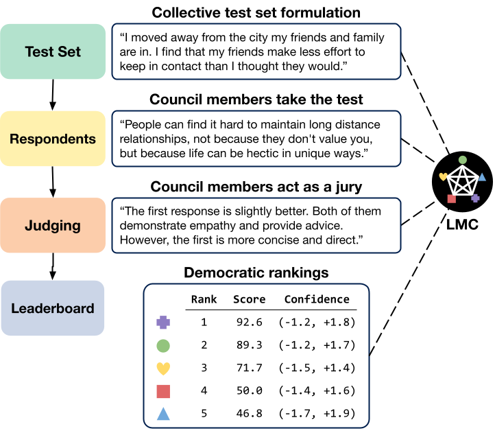

# Language Model Council: Benchmarking Foundation Models on Highly Subjective Tasks by Consensus

**Justin Zhao<sup>&dagger;</sup>, Flor Miriam Plaza-del-Arco<sup>&Dagger;</sup>, Benjamin Genchel<sup>&dagger;</sup>, Amanda Cercas Curry<sup>&Dagger;</sup>**

&dagger; Independent, &Dagger; Bocconi University

<p align="center">
  
</p>

## Quick links

- Website: <https://llm-council.com>
- Dataset: <https://huggingface.co/datasets/llm-council/emotional_application>
- Paper: <https://arxiv.org/abs/2406.08598>

## Abstract

As Large Language Models (LLMs) continue to evolve, the search for efficient and meaningful evaluation methods is ongoing. Many recent evaluations use LLMs as judges to score outputs from other LLMs, often relying on a single large model like GPT-4o. However, using a single LLM judge is prone to intra-model bias, and many tasks - such as those related to emotional intelligence, creative writing, and persuasiveness - may be too subjective for a single model to judge fairly. We introduce the Language Model Council (LMC), where a group of LLMs collaborate to create tests, respond to them, and evaluate each other's responses to produce a ranking in a democratic fashion. Unlike previous approaches that focus on reducing cost or bias by using a panel of smaller models, our work examines the benefits and nuances of a fully inclusive LLM evaluation system. In a detailed case study on emotional intelligence, we deploy a council of 20 recent LLMs to rank each other on open-ended responses to interpersonal conflicts. Our results show that the LMC produces rankings that are more separable and more robust, and through a user study, we show that they are more consistent with human evaluations than any individual LLM judge. Using all LLMs for judging can be costly, however, so we use Monte Carlo simulations and hand-curated sub-councils to study hypothetical council compositions and discuss the value of the incremental LLM judge.

## Analysis notebooks

In `analysis/`, we provide in-depth jupyter notebooks to reproduce the findings and figures reported in the
Language Model Council paper.

## Multi-provider REST-based parallel processing

We provide a unified and configurable batch parallel processing interface designed for interacting with multiple large language model (LLM) service providers through RESTful APIs.

### Setup

Set up python venv.

```sh
python3.12 -m venv env
source env/bin/activate
```

Install requirements.

```sh
pip install -r requirements.txt
pip install -e .
```

Add secrets to a `.env` file. See `.env.example` for an example.

```env
OPENAI_API_KEY = ""
HUGGING_FACE_HUB_TOKEN = ""
ANTHROPIC_API_KEY = ""
MISTRAL_API_KEY = ""
TOGETHER_API_KEY = ""
COHERE_API_KEY = ""
VERTEX_PROJECT_ID = ""
VERTEX_API_KEY = ""
CEREBRAS_API_KEY = ""
```

### Supported providers

- [OpenAI](https://platform.openai.com/docs/api-reference)
- [Mistral](https://docs.mistral.ai/api/)
- [Together](https://docs.together.ai/docs/inference-rest)
- [Vertex AI](https://cloud.google.com/vertex-ai/docs/reference/rest)
- [Cohere](https://docs.cohere.com/reference/chat)
- [Anthropic](https://docs.anthropic.com/en/api/messages)
- [Cerebras](https://inference-docs.cerebras.ai/introduction)
- [Lepton](https://www.lepton.ai/docs/public_models/model_apis)

Providers may have unique constraints on token limits (TPS or TPM), rate lmits (RPS or RPM), or
both. Providers have slight variations in request/request payloads. Our unified interface
streamlines this.

### Sample execution with a hypothetical council (9-steps)

1. Generate completion requests for interpersonal conflict generation.

    ```sh
    python llm_council/generate_completion_requests.py \
        --prompt_template_key generate_expansion \
        --jsonl_input_file data/emobench_ea.jsonl \
        --outdir experiments/dilemma_expansion/collection \
        --temperature 0.5 \
        --llm_allowlist together://meta-llama/Llama-3-8b-chat-hf \
        --llm_allowlist together://meta-llama/Llama-3-70b-chat-hf \
        --llm_allowlist together://Qwen/Qwen1.5-32B-Chat
    ```

    This will generate a directory tree under `outdir` following the pattern `<provider>/<llm>/requests.jsonl`.
    `requests.jsonl` contains all of the REST request payloads.

    NOTE: Remove all `--llm_allowlist` arguments to use the full council, defined in `constants.py`.

2. Collect interpersonal conflicts from multiple LLMs.

    ```sh
    python llm_council/invocation/execute_council.py \
        --requests_dir experiments/dilemma_expansion/collection
    ```

    All of the REST response payloads will be saved alongside the `requests.jsonl` files in the corresponding directories `<provider>/<llm>/responses.jsonl`.

3. Conslidate interpersonal conflicts from multiple LLMs.

    ```sh
    python llm_council/consolidate_council_responses.py \
        --council_response_metadata_key completion_response \
        --responses_dir experiments/dilemma_expansion/collection \
        --outdir experiments/dilemma_expansion
    ```

    The consolidated responses from all council members will be saved in: `experiments/dilemma_expansion/consolidated_responses.jsonl`.

4. Generate completion requests for conversational responses.

    ```sh
    python llm_council/generate_completion_requests.py \
        --prompt_template_key conversational_dilemma_response \
        --jsonl_input_file experiments/dilemma_expansion/consolidated_responses.jsonl \
        --outdir experiments/conversational_response/collection \
        --word_limit 250 \
        --llm_allowlist together://meta-llama/Llama-3-8b-chat-hf \
        --llm_allowlist together://meta-llama/Llama-3-70b-chat-hf \
        --llm_allowlist together://Qwen/Qwen1.5-32B-Chat
    ```

    Same as step 1, but for collecting conversational responses.

5. Collect conversational responses from multiple LLMs.

    ```sh
    python llm_council/invocation/execute_council.py \
        --requests_dir experiments/conversational_response/collection
    ```

    Same as step 2, but for conversational responses.

6. Conslidate conversational responses from multiple LLMs.

    ```sh
    python llm_council/consolidate_council_responses.py \
        --council_response_metadata_key completion_response \
        --responses_dir experiments/conversational_response/collection \
        --outdir experiments/conversational_response
    ```

    The consolidated responses from all council members will be saved in: `experiments/conversational_response/consolidated_responses.jsonl`.

7. Generate requests for judging conversational responses.

    ```sh
    python llm_council/generate_judging_requests.py \
        --input_jsonl_file experiments/conversational_response/consolidated_responses.jsonl \
        --outdir experiments/conversational_response_judging/collection \
        --prompt_template_key judge_conversational_dilemma_response_sxs_granular_no_tie \
        --reference_llm together://Qwen/Qwen1.5-32B-Chat \
        --llm_allowlist together://meta-llama/Llama-3-8b-chat-hf \
        --llm_allowlist together://meta-llama/Llama-3-70b-chat-hf \
        --llm_allowlist together://Qwen/Qwen1.5-32B-Chat
    ```

8. Collect judgements and ratings from multiple LLMs.

    ```sh
    python llm_council/invocation/execute_council.py \
        --requests_dir experiments/conversational_response_judging/collection
    ```

9. Conslidate conversational responses from multiple LLMs.

    ```sh
    python llm_council/consolidate_council_responses.py \
        --council_response_metadata_key judging_response \
        --responses_dir experiments/conversational_response_judging/collection \
        --outdir experiments/conversational_response_judging
    ```

Done!

### Adding a prompt

Define the prompt in `prompts.py` and add it to the registry `PROMPT_REGISTRY`. Once in the registry, the prompt can be referred to by key in command line arguments, e.g. `--prompt_template_key`.

The dictionary objects from the `--input_jsonl_file` are passed to the prompt template for formatting, so make sure the keyword bracketed placeholder variables `{}` and the fields in the `--input_jsonl_file` are consistent. If in doubt, generate requests first and manually inpsect them.

#### Adding an LLM as a council member

The convention for specifying an LLM is `<provider>://<llm>`.

To add an LLM to the default council, add the LLM to `constants.py`. However, if the provider is already supported, the LLM can be specified directly `--llm_allowlist` in provided parallel processing scripts, as long as the LLM name is correct.

For 1-off testing, refer to `issue_single_prompt.py`.

### Adding a new Provider

Under `llm_council/processors/services/`, define a new class that implements the `BaseProvider` class. For example:

```python
import dotenv
import os
import logging

from llm_council.providers.base_provider import BaseProvider

# Load credentials from a .env file.
dotenv.load_dotenv()


class OpenAIProvider(BaseProvider):
    """https://platform.openai.com/docs/api-reference/making-requests"""

    def __init__(self, llm) -> None:
        BaseProvider.__init__(self, llm)

        if "gpt-4o-mini" in llm:
            self.max_requests_per_minute = 30000
        elif "gpt-4o" in llm:
            self.max_requests_per_minute = 10000
        elif "o1-preview" in llm:
            self.max_requests_per_minute = 500
        elif "o1-mini" in llm:
            self.max_requests_per_minute = 1000
        else:
            logging.warning(
                f"Unknown model for OpenAI Service: {llm}. Using default rate limit of 10K RPM."
            )
            self.max_requests_per_minute = 10000

    def __api_key(self) -> str | None:
        return os.getenv("OPENAI_API_KEY")

    def request_url(self) -> str:
        return "https://api.openai.com/v1/chat/completions"

    def request_header(self) -> dict:
        return {"Authorization": f"Bearer {self.__api_key()}"}

    def sample_request(self) -> dict:
        return {
            "model": "gpt-4o-mini",
            "messages": [{"role": "user", "content": "Say hello!"}],
        }

    def rate_limit_time_unit(self) -> str:
        return "minutes"

    def max_requests_per_unit(self) -> int:
        return self.max_requests_per_minute

    def max_tokens_per_minute(self) -> int:
        return 290000

    def get_request_prompt(self, request: dict) -> str:
        return request["messages"][0]["content"]

    def get_request_body(
        self, user_prompt: str, temperature: float | None, schema_name: str | None
    ) -> dict:
        request = {
            "model": self.model_name,
            "messages": [{"role": "user", "content": user_prompt}],
        }
        if temperature is not None:
            request["temperature"] = temperature
        if schema_name is not None:
            schema_class = STRUCTURED_OUTPUT_REGISTRY.get(schema_name)
            if schema_class is None:
                raise ValueError(f"Invalid schema: {schema_name}")
            request["response_format"] = {
                "type": "json_schema",
                "json_schema": {
                    "name": schema_name,
                    "schema": schema_class.schema(),
                },
            }
        return request

    def get_response_string(self, json_response: dict) -> str:
        return json_response["choices"][0]["message"]["content"]

    def get_response_info(self, json_response: dict) -> dict:
        return {
            "llm": self.llm,
            "model_name": self.model_name,
            "id": json_response["id"],
            "usage": json_response["usage"],
        }
```

Then, import the service and add it to the provider registry in `llm_council/processors/services/__init__.py`

Finally, add valid qualified provider paths to `llm_council/constants.py`, e.g.

```py
[
    "openai://gpt-3.5-turbo-0125",
    "openai://gpt-4-turbo-2024-04-09",
    "openai://gpt-4-0613",  # gpt-4
    "openai://gpt-4o-mini-2024-07-18",
    "openai://gpt-4o-2024-08-06",
    "openai://o1-preview-2024-09-12",
    "openai://o1-mini-2024-09-12",
]
```

#### Add a new structured output schema

Add a dataclass to `llm_council/structured_outputs.py`.

```python
class ReasoningThenAnswer(BaseSchema):
    reasoning: str
    answer: str

    @staticmethod
    def method(reasoning: Annotated[str, ""], answer: Annotated[str, ""]):
        pass


class AnswerThenReasoning(BaseSchema):
    answer: str
    reasoning: str

    @staticmethod
    def method(answer: Annotated[str, ""], reaonsing: Annotated[str, ""]):
        pass
```

NOTE: The `method()` staticmethod is necessary for the Lepton provider as their interface uses an
annotated function call to enable constrained decoding.

## Roadmap

Loosely:

- Add additional providers and services as they come into the market.
- Enable customized per-llm rate limits as different developers may be on different tiers.
- Simplify how users customize council compositions for completion and judging.
- Flush out end-to-end interface for executing the council on a single prompt.
- Add tests.

Happy Council-ing!
