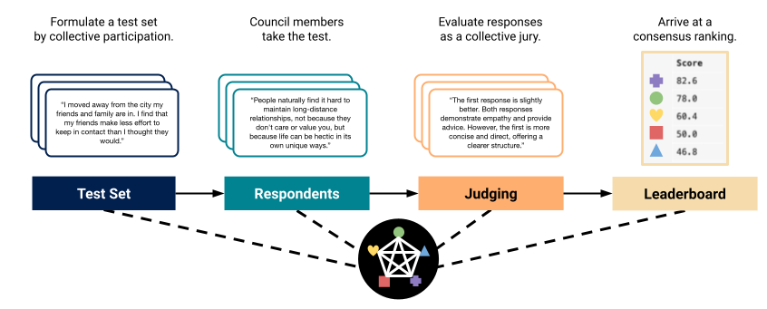

<p align="center">
  
</p>

# Language Model Council: Benchmarking Foundation Models on Highly Subjective Tasks by Consensus

**Justin Zhao<sup>&dagger;</sup>, Flor Miriam Plaza-del-Arco<sup>&Dagger;</sup>, Amanda Cercas Curry<sup>&Dagger;</sup>**

&dagger; Predibase, &Dagger; Bocconi University

Website: https://llm-council.com
Paper: TODO
Dataset: https://huggingface.co/datasets/llm-council/emotional_application

## Abstract

The rapid advancement of Large Language Models (LLMs) necessitates robust
and challenging benchmarks. Leaderboards like Chatbot Arena rank LLMs based
on how well their responses align with human preferences. However, many tasks
such as those related to emotional intelligence, creative writing, or persuasiveness,
are highly subjective and often lack majoritarian human agreement. Judges may
have irreconcilable disagreements about what constitutes a better response. To
address the challenge of ranking LLMs on highly subjective tasks, we propose
a novel benchmarking framework, the **Language Model Council (LMC)**. The
LMC operates through a democratic process to: 1) formulate a test set through
equal participation, 2) administer the test among council members, and 3) evaluate
responses as a collective jury. We deploy a council of 20 newest LLMs on an
open-ended emotional intelligence task: responding to interpersonal dilemmas.
Our results show that the LMC produces rankings that are more separable, robust,
and less biased than those from any individual LLM judge, and is more consistent
with a human-established leaderboard compared to other benchmarks.

## Multi-provider REST-based parallel processing

We provide a unified and configurable batch parallel processing interface designed for interacting with multiple large language model (LLM) service providers through RESTful APIs.

### Setup

Set up python venv.

```sh
python3.12 -m venv env
source env/bin/activate
```

Install requirements.

```sh
pip install -r requirements.txt
pip install -e .
```

Add secrets to a `.env` file. See `.env.example` for an example.

```env
OPENAI_API_KEY = ""
HUGGING_FACE_HUB_TOKEN = ""
ANTHROPIC_API_KEY = ""
MISTRAL_API_KEY = ""
TOGETHER_API_KEY = ""
COHERE_API_KEY = ""
VERTEX_PROJECT_ID = ""
VERTEX_API_KEY = ""
```

### Supported providers

- [OpenAI](https://platform.openai.com/docs/api-reference)
- [Mistral](https://docs.mistral.ai/api/)
- [Together](https://docs.together.ai/docs/inference-rest)
- [Vertex AI](https://cloud.google.com/vertex-ai/docs/reference/rest)
- [Cohere](https://docs.cohere.com/reference/chat)
- [Anthropic](https://docs.anthropic.com/en/api/messages)

Providers may have unique constraints on token limits (TPS or TPM), rate lmits (RPS or RPM), or
both. Providers have slight variations in request/request payloads. Our unified interface
streamlines this.

### Sample execution with a hypothetical council (9-steps)

1. Generate completion requests for interpersonal conflict generation.

    ```sh
    python llm_council/generate_completion_requests.py \
        --prompt_template_key generate_expansion \
        --jsonl_input_file data/emobench_ea.jsonl \
        --outdir experiments/dilemma_expansion/collection \
        --temperature 0.5 \
        --llm_allowlist together://meta-llama/Llama-3-8b-chat-hf \
        --llm_allowlist together://meta-llama/Llama-3-70b-chat-hf \
        --llm_allowlist together://Qwen/Qwen1.5-32B-Chat
    ```

    This will generate a directory tree under `outdir` following the pattern `<provider>/<llm>/requests.jsonl`.
    `requests.jsonl` contains all of the REST request payloads.

    NOTE: Remove all `--llm_allowlist` arguments to use the full council, defined in `constants.py`.

2. Collect interpersonal conflicts from multiple LLMs.

    ```sh
    python llm_council/invocation/execute_council.py \
        --requests_dir experiments/dilemma_expansion/collection
    ```

    All of the REST response payloads will be saved alongside the `requests.jsonl` files in the corresponding directories `<provider>/<llm>/responses.jsonl`.

3. Conslidate interpersonal conflicts from multiple LLMs.

    ```sh
    python llm_council/consolidate_council_responses.py \
        --council_response_metadata_key completion_response \
        --responses_dir experiments/dilemma_expansion/collection \
        --outdir experiments/dilemma_expansion
    ```

    The consolidated responses from all council members will be saved in: `experiments/dilemma_expansion/consolidated_responses.jsonl`.

4. Generate completion requests for conversational responses.

    ```sh
    python llm_council/generate_completion_requests.py \
        --prompt_template_key conversational_dilemma_response \
        --jsonl_input_file experiments/dilemma_expansion/consolidated_responses.jsonl \
        --outdir experiments/conversational_response/collection \
        --word_limit 250 \
        --llm_allowlist together://meta-llama/Llama-3-8b-chat-hf \
        --llm_allowlist together://meta-llama/Llama-3-70b-chat-hf \
        --llm_allowlist together://Qwen/Qwen1.5-32B-Chat
    ```

    Same as step 1, but for collecting conversational responses.

5. Collect conversational responses from multiple LLMs.

    ```sh
    python llm_council/invocation/execute_council.py \
        --requests_dir experiments/conversational_response/collection
    ```

    Same as step 2, but for conversational responses.

6. Conslidate conversational responses from multiple LLMs.

    ```sh
    python llm_council/consolidate_council_responses.py \
        --council_response_metadata_key completion_response \
        --responses_dir experiments/conversational_response/collection \
        --outdir experiments/conversational_response
    ```

    The consolidated responses from all council members will be saved in: `experiments/conversational_response/consolidated_responses.jsonl`.

7. Generate requests for judging conversational responses.

    ```sh
    python llm_council/generate_judging_requests.py \
        --input_jsonl_file experiments/conversational_response/consolidated_responses.jsonl \
        --outdir experiments/conversational_response_judging/collection \
        --prompt_template_key judge_conversational_dilemma_response_sxs_granular_no_tie \
        --reference_llm together://Qwen/Qwen1.5-32B-Chat \
        --llm_allowlist together://meta-llama/Llama-3-8b-chat-hf \
        --llm_allowlist together://meta-llama/Llama-3-70b-chat-hf \
        --llm_allowlist together://Qwen/Qwen1.5-32B-Chat
    ```

8. Collect judgements and ratings from multiple LLMs.

    ```sh
    python llm_council/invocation/execute_council.py \
        --requests_dir experiments/conversational_response_judging/collection
    ```

9. Conslidate conversational responses from multiple LLMs.

    ```sh
    python llm_council/consolidate_council_responses.py \
        --council_response_metadata_key judging_response \
        --responses_dir experiments/conversational_response_judging/collection \
        --outdir experiments/conversational_response_judging
    ```

Done!

### Expanding to more use cases

We are actively working to improve this interface. For now, you will need to change specific files in the repository.

#### Adding a prompt

Define the prompt in `prompts.py` and add it to the registry `PROMPT_REGISTRY`. Once in the registry, the prompt can be referred to by key in command line arguments, e.g. `--prompt_template_key`.

The dictionary objects from the `--input_jsonl_file` are passed to the prompt template for formatting, so make sure the keyword bracketed placeholder variables `{}` and the fields in the `--input_jsonl_file` are consistent. If in doubt, generate requests first and manually inpsect them.

#### Adding an LLM as a council member

The convention for specifying an LLM is `<provider>://<llm>`.

To add an LLM to the default council, add the LLM to `constants.py`. However, if the provider is already supported, the LLM can be specified directly `--llm_allowlist` in provided parallel processing scripts, as long as the LLM name is correct.

For 1-off testing, refer to `issue_single_prompt.py`.

#### Adding a new Provider

In `services.py` define a new class that implements the `BaseService` class. For example:

```python
class OpenAIService(BaseService):
    """https://platform.openai.com/docs/api-reference/making-requests"""

    def __init__(self, llm) -> None:
        BaseService.__init__(self, llm)

        if "gpt-3.5-turbo" in llm:
            self.max_requests_per_minute = 3500
        elif "gpt-4" in llm:
            self.max_requests_per_minute = 5000

    def __api_key(self) -> str:
        return os.getenv("OPENAI_API_KEY")

    def request_url(self) -> str:
        return "https://api.openai.com/v1/chat/completions"

    def request_header(self) -> dict:
        return {"Authorization": f"Bearer {self.__api_key()}"}

    def sample_request(self) -> dict:
        return {
            "model": "gpt-3.5-turbo-0613",
            "messages": [{"role": "user", "content": "Say hello!"}],
        }

    def rate_limit_time_unit(self) -> str:
        return "minutes"

    def max_requests_per_unit(self) -> int:
        return self.max_requests_per_minute

    def max_tokens_per_minute(self) -> int:
        return 290000

    def get_request_body(self, user_prompt: str, temperature: float | None) -> dict:
        if temperature is not None:
            return {
                "model": self.model_name,
                "messages": [{"role": "user", "content": user_prompt}],
                "temperature": temperature,
            }
        else:
            return {
                "model": self.model_name,
                "messages": [{"role": "user", "content": user_prompt}],
            }

    def get_response_string(self, json_response: dict) -> str:
        return json_response["choices"][0]["message"]["content"]

    def get_response_info(self, json_response: dict) -> dict:
        return {
            "llm": self.llm,
            "model_name": self.model_name,
            "id": json_response["id"],
            "usage": json_response["usage"],
        }

    def get_request_prompt(self, request: dict) -> str:
        return request["messages"][0]["content"]
```

Finally, add the service to the `PROVIDER_REGISTRY`.

Happy Council-ing!